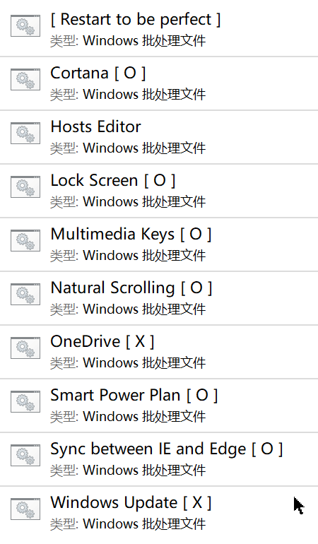

# PerfectWindows

## 助您打造心目中最完美的 Windows ！

## 功能
> 您可以依您的喜好启用或禁用功能。
### 1. 消灭 Windows 中的广告
* 还您一个清静的 Windows 。
### 2. 消灭令您厌烦的 Windows 功能
* 您可以**按需**禁用 Cortana、OneDrive、锁屏以及 **Windows 自动更新**。
* **禁用 Windows 自动更新并不影响您手动检查、下载和安装更新。**
### 3. 添加音视频播放控制键
|按键|功能|
|:-|:-|
|<kbd>Page Up</kbd>|增大系统音量
|<kbd>Page Down</kbd>|减小系统音量（直到静音）
|<kbd>End</kbd>|下一个（跳转至结尾）
|<kbd>Home</kbd>|上一个（跳转至开头）
### 4. 添加智能电源计划
* **自动**根据电脑供电模式切换电源计划，无需您操劳。

|供电来源|电源计划|
|:-|:-|
|电池|节能
|外接|高性能
### 5. 使 Edge 与 IE 的书签保持一致
### 6. 加速 Windows
* 禁用无用且会拖慢电脑的 Windows 后台服务，比如 Superfetch、家庭组、程序兼容性助手和 IP Helper 。
### 7. 加固 Windows
* **增强 Windows Defender 的防护能力。**
* **禁用 SMB v1 协议与 U 盘自动播放，帮助您防范利用漏洞发起攻击的勒索软件和通过 U 盘传播的病毒。**
### 8. 找回 Windows 10 照片查看器
### 9. 让 Windows 10 的任务栏更透明
### 10. 添加鼠标自然滚动功能
* 就像 Mac 那样。
### 11. 在文件资源管理器中隐藏系统文件夹
* 眼不见，心不烦。
* 以下系统文件夹将不会显示在文件资源管理器中：
```
%systemroot%
%ProgramFiles%
%ProgramFiles(x86)%
%ProgramData%
%systemdrive%\Users
%systemdrive%\PerfLogs
%systemdrive%\Windows.old
%userprofile%\ntuser.dat
%userprofile%\ntuser.ini
%userprofile%\AppData
%LocalAppData%
%LocalAppData%\Packages
%AppData%
%userprofile%\AppData\LocalLow
```
* 如需访问被隐藏的系统文件夹，请使用环境变量或快捷方式。
## 使用方法
1. 点击绿色按钮，并选择 “Download Zip”。
2. 打开压缩包，将 PerfectWindows 文件夹拖到你易于访问的位置，比如桌面。
3. 将每一项的设置调整为适合你的选项，其中【X】代表禁用，【O】代表启用，双击对应的批处理文件即可让【X】与【O】相互切换。
4. 确认你的设置无误后，**以管理员身份运行**【Logoff to be perfect】或者【Restart to be perfect】以使所有设置生效，**您的电脑将自动注销或重启**。
5. 好了，您已经拥有了完美的 Windows。
## 软件截图

## 中英文对照表
* 为了避免编码错误，我不得不以英文命名批处理文件。

|英文|中文|
|:-|:-|
|Restart to be perfect|重启以优化 Windows|
|Logoff to be perfect|注销以优化 Windows|
|Hosts Editor|Hosts 编辑器|
|Multimedia Keys|音视频播放控制键|
|Natural Scrolling|鼠标自然滚动|
|Smart Power Plan|智能电源选项|
|Sync between IE and Edge|使 Edge 与 IE 的书签保持一致|
|Windows Update|Windows 自动更新|
