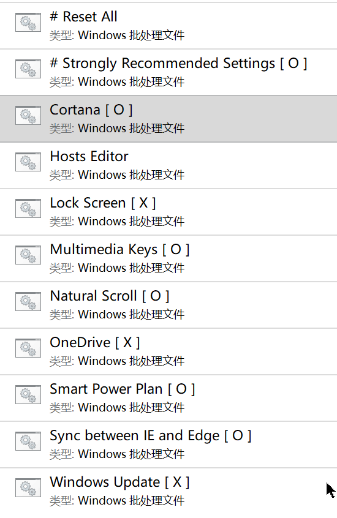

# PerfectWindows

> 打造您心目中最完美的 Windows 。

## 功能
### 1. 消灭 Windows 中的广告
> 还您一个清静的 Windows 。
### 2. 消灭您不喜欢的 Windows 功能
> 您可以按需禁用 Cortana、OneDrive、锁屏以及 Windows 自动更新。
### 3. 添加多媒体控制键
> 您可以按需启用该功能。  

|按键|功能|
|:---:|:------:|
|<kbd>Page Up</kbd>|增大音量
|<kbd>Page Down</kbd>|减小音量
|<kbd>End</kbd>|跳转到当前歌曲或视频的结尾，即播放下一首歌曲或下一段视频
|<kbd>Home</kbd>|跳转到当前歌曲或视频的开头，或播放上一首歌曲或上一段视频

### 4. 加速 Windows
> Strongly Recommended Settings 会禁用无用且会拖慢电脑的 Windows 后台服务，比如 Superfetch、家庭组、程序兼容性助手和 IP Helper 。
### 5. 加固 Windows
> Strongly Recommended Settings 不仅会增强 Windows Defender 的防护能力，还会禁用 SMB v1 协议、NetBIOS、文件共享与 U 盘自动播放，帮助您防范利用漏洞发起攻击的勒索软件和通过 U 盘传播的病毒。
## 效果图

> 这个动图演示了禁用 Cortana 的过程。

